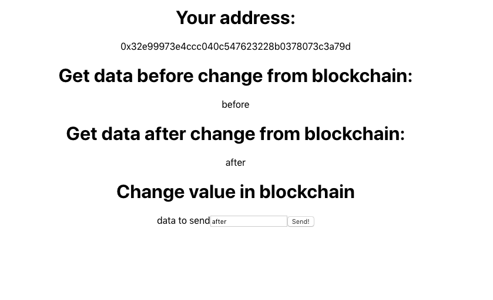

# HooksMessageBox
This Truffle box is a simple basic exemple to start coding dapp with React using hooks. With this box, you can set a data to a smart contract and get this value. This exemple works with testnet ropsten for the moment.
## Download Box
```sh
truffle unbox jecombe/hooks_message_box
```

## Installation
You need to have:  
-metamask and connect to ropsten testnet   
-ether faucet ropsten

Install dependencies
```sh
npm install
```
## Start Dapp
Go to main directory and run:
```sh
npm start
```
Go to navigator (localhost:3000), and you have this:


## Deploy smart contract
if you want to deploy smart contract, you need to connect to ropsten, add your infuraKey in:
```sh
[contract/truffle-config.js]  const infuraKey = ""; line 22
```
And add mnemonic from metamask:
```sh
[contract/truffle-config.js]  const mnemonic = ''; line 25
```
After you can deploy, goo to main directory:

```sh
truffle compile && truffle migrate --network ropsten
```
For front-end, you must change this address with address obtained with truffle deploy:
```sh
[src/Message.json]  "address" line 120
```
